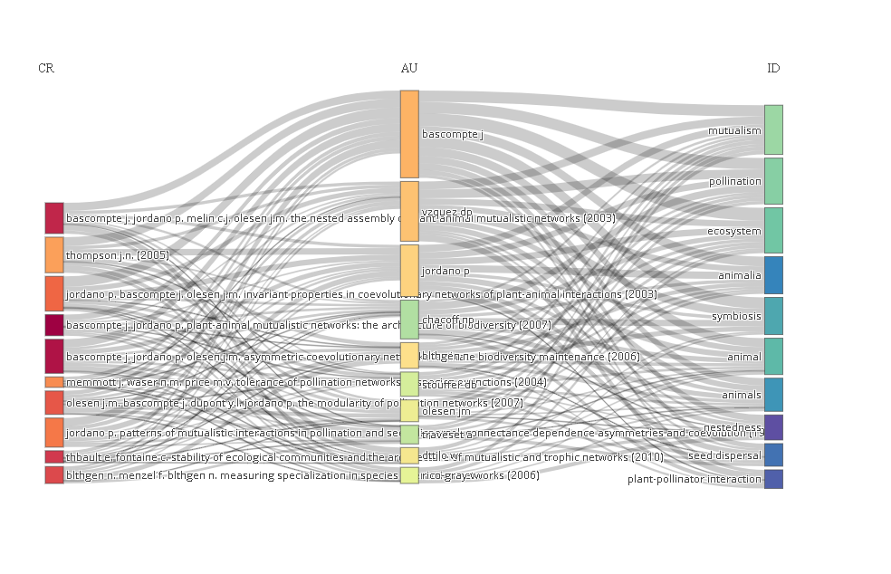
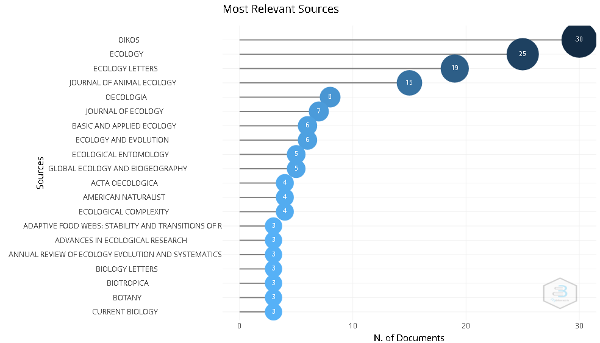
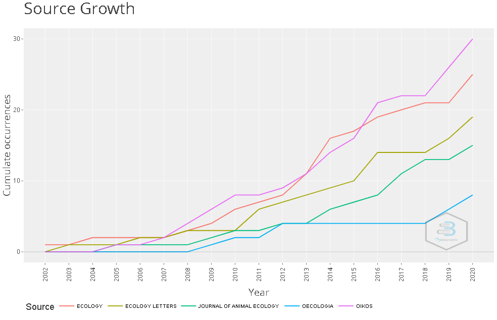

```{r setup, include=FALSE}
knitr::opts_chunk$set(echo = TRUE)
```

# Introducción.

El presente trabajo pretende ser una guía para aprender a utilizar las principales herramientas que ofrece bibliometrix para realizar un buen análisis bibliográfico. No somos pocos los alumnos de carreras investigadoras que, a la hora de enfrentarnos a la realización del TFG, optamos por una revisión bibliográfica sin tener la más mínima idea de como enfrentarnos al tema. Empezamos a conocer las principales bases de datos en unos pocos días y tras las primeras búsquedas es común encontrarnos con un volumen de información inabarcable para una mente humana.

Son muchos los aspectos a tener en cuenta durante una revisión bibliográfica, pero partiremos de las siguientes bases:

-   Sabes qué tema quieres tratar.
-   Sabes en qué bases de datos tienes que buscar y como hacer los primeros filtrados con las herramientas que estos te proporcionan.
-   Sabes como descargar dicha información y conoces el formato `BibTeX`.

Por tanto, partimos de la base de que ya tienes la información que quieres para tu trabajo, pero careces de las herramientas para saber cuales son los artículos mas relevantes o como ha evolucionado este campo de estudio desde sus inicios. En la [página web oficial de bibliometrix](https://www.bibliometrix.org/) se pueden encontrar muchos tutoriales para aprender a utilizar esta herramienta, sin embargo todos ellos los encontrarás en inglés. Independientemente de la necesidad de aprender inglés en un mundo globalizado como es el nuestro, la liberalización de la ciencia pasa por ofrecer trabajos accesibles para cualquiera, para lo cuál tenemos que luchar por una mayor presencia de la ciencia en español. Una parte importante de este trabajo, especialmente en los anexos, son traducciones literales de unas [diapositivas explicativas](https://bibliometrix.org/biblioshiny/assets/player/KeynoteDHTMLPlayer.html#1) de su página web. 

# Bibliometrix y el lenguaje R.

La bibliometría es el estudio matemático y estadístico de las distintas características de un volumen de artículos académicos, libros etc [@bibliometrics]. La bibliometría resulta útil al ofrecer un análisis estructurado de un gran volumen de información para [@Aria2017]:

-   Inferir tendencias o temas de moda.
-   Identificar los aspectos mas estudiados.
-   Identificar cambios de paradigma en la historia del estudio de dicho tema.
-   Identificar los autores, revistas o instituciones que más han aportado a dicho campo.
-   Ofrecer una imagen general del tema de estudio.

Bibliometrix es un paquete de análisis bibliométrico que corre bajo lenguaje de programación R. El lenguaje de programación R es un lenguaje y un entorno para el cálculo estadístico y su representación gráfica. R ofrece una gran variedad de técnicas estadísticas (modelización lineal y no lineal, pruebas estadísticas clásicas, análisis de series temporales, clasificación, agrupación, ...) y gráficas, y es muy expansible [@whatisr]. Si bien R puede ofrecer herramientas estadísitcas similares a otros programas de este campo, la versatilidad de R reside en que es de código abierto, lo que significa que cualquiera puede [descargarlo gratuitamente](https://www.rstudio.com/products/rstudio/download/), acceder a su código fuente y elaborar sus propias herramientas. Tal es la versatilidad de R que este texto esta siendo escrito y será procesado a través de este lenguaje de programación.


Es esta versatilidad la que permitió a Massimo Aria y Corrado Cuccurullo crear un paquete de análisis bibliométrico que presenta la capacidad de sintetizar los resultados sobre las investigaciones científicas de un determinado campo de la ciencia y ofrecer vistosas e informativas representaciones gráficas [@bibrpack]. Uno de los problemas que puede representar RStudio para el usuario promedio es la necesidad de tener que empezar a familiarizarse con un nuevo lenguaje de programación. Sin embargo, esto no resulta un problema con bibliometrix porque sus autores han desarrollado una interfaz más amigable. Lo único que necesitarás hacer en Rstudio será cargar el paquete de bibliometrix ejecutando los siguientes comandos en la consola:

    install.packages("bibliometrix")

    library(bibliometrix)

Y posteriormente ejecutar su interfaz llamada biblioshiny:

    biblioshiny()
    
Cuando ejecutes este comando se te abrirá una pestaña de tu navegador predeterminado con la siguiente interfaz:


# Bases de datos y como cargarlos. 

Utilizaremos  para nuestra busqueda dos bases de datos: Scopus y Web of Science (WOS). Scopus es más amigable con el usuario novato y da la posibilidad de buscar tanto hacia adelante como hacia atrás a partir de una cita concreta. Ambos buscadores almacenan información de artículos de muy diversas disciplinas, lo que permite al investigador buscar fácilmente fuera de su campo de estudio. WOS, por su parte, presenta una mayor profunidad de cobertura, ya que la base de datos completa de WOS se remonta a 1945 y la de Scopus a 1966. El uso de estas dos bases de datos nos dará un volumen de información lo suficientemente completo para nuestra investigación[@Burnham2006]. 

A la hora de exportar los datos eligiremos el formato `plaintext`(WOS) o `BibTeX`(Scopus), ya que son los que menos problemas suele dar con bibliometrix. Aunque tenemos la posibilidad de usar comandos para convertir nuestros datos a objetos que puede manejar bibliometrix, partimos de la premisa de que queremos trastocar con lenguaje de programación lo menos posible. Si quisieras trastocar con distintos comandos para convertir formatos de las distintas bases de datos puedes descargarte un manual [aquí](https://www.bibliometrix.org/vignettes/Data-Importing-and-Converting.html).

## Scopus. 

Acudimos a **Scopus** y buscamos información sobre *Mutualistic Newtwork* en **Article Title, Absrtract and Keywords**. El primer resultado nos arroja 406 resultados (TITLE-ABS-KEY ( "mutualistic network" )), pero realizaremos un filtrado a través del apartado **Subject Area** de aquellas disciplinas que se salen de nuestro campo de estudio, en nuestro caso queremos enfocarnos en el estudio de los ecosistemas. Tras el filtrado, la busqueda avanzada queda así:

TITLE-ABS-KEY ( "mutualistic network" )  AND  ( EXCLUDE ( SUBJAREA ,  "MULT" )  OR  EXCLUDE ( SUBJAREA ,  "PHYS" )  OR  EXCLUDE ( SUBJAREA ,  "IMMU" )  OR  EXCLUDE ( SUBJAREA ,  "MATH" )  OR  EXCLUDE ( SUBJAREA ,  "COMP" )  OR  EXCLUDE ( SUBJAREA ,  "ENGI" )  OR  EXCLUDE ( SUBJAREA ,  "NEUR" )  OR  EXCLUDE ( SUBJAREA ,  "CHEM" )  OR  EXCLUDE ( SUBJAREA ,  "CENG" )  OR  EXCLUDE ( SUBJAREA ,  "MATE" )  OR  EXCLUDE ( SUBJAREA ,  "MEDI" )  OR  EXCLUDE ( SUBJAREA ,  "DECI" )  OR  EXCLUDE ( SUBJAREA ,  "PHAR" )  OR  EXCLUDE ( SUBJAREA ,  "PSYC" )  OR  EXCLUDE ( SUBJAREA ,  "SOCI" )  OR  EXCLUDE ( SUBJAREA ,  "ECON" ) ) [^1]

[^1]: La búsqueda avanzada en Scopus implica el empleo de comandos de búsqueda basados en códigos, y está destinada a realizar búsquedas muy complejas, que exijan tal combinación de elementos, que las anteriores opciones de búsqueda no sean efectivas. Dado que Scopus no permite compartir busquedas a través de enlaces, comparto aquí el código de la busqueda avanzada. Con pegar este texto en la barra de busqueda deberías obtener los mismos resultados. 

Descargamos la bibliografía en formato `BibTeX` con toda la información que nos permite Scopus (Citation information, Bibliographical information, Abstract & keywords, Funding details y Other Information).

## Web of Science. 

Acudimos a **Web of Science** y buscamos información sobre [*Mutualistic Networks*](https://www.webofscience.com/wos/alldb/summary/965e996b-ce32-4096-b23b-3d5fc1090cd3-1b146a07/relevance/1) en **Topic**. Poseo cierto conocimiento previo sobre este area, aportado gracias a artículos divulgativos que pueden encontrarse facilmente. Esto me permite realizar un filtrado de los resultados, ya que quiero enfocarme para mi TFG en el *corpus* teórico que ofrecen las redes mutualistas al estudio de los ecosistemas. Para ello eliminé los resultados que parecen desviarse demasiado de este tema, pero sin ser demasiado restrictivo, ya que el volumen de resultados original (199) tampoco es demasiado grande y un filtrado demasiado estricto podría dejarme con muy pocos datos para obtener información relevante en el posterior análisis. Sin embargo, hay que tener en cuenta que el filtrado de los datos inicial dependerá muchos de los intereses y situación de cada investigador. La busqueda quedó finalmente en [160 resultados](https://www.webofscience.com/wos/alldb/summary/96d9e399-8558-49a7-bcc4-23b8a83d4a6e-1b14ad06/relevance/1).

# Importar datos a biblioshiny. 

En la primera pestaña denominada `Data` podemos cargar los datos a través de la opción `Import or Load Files`. La segunda opción llamada `Gather Data using APIs` permite recopilar la bibliografía directamente de las bases de datos correspondientes, pero solo permite recoger datos de **Pubmed** y **Dimensions**, lo que se sale de las bases de datos que queremos utilizar. 

Para evitar tener que pasar por el uso de comandos de conversión en la consola seleccionaremos en **Please, choose what to do** la opción `Import raw files`, lo que significa que estamos importando datos que descargamos directamente de la base de datos correspondiente, sin realizar un proceso de conversión.  

**ARREGLAR EL PROBLEMA DE IMPORTACION EN BIBLIOSHINY CON WOS**

# Filtrar datos con Biblioshiny. 

Biblioshiny nos permite eliminar algunos datos de nuestra dependiendo de nuestros intereses a través de la pestaña `Filter`. Entre las opciones que nos ofrece nos permite filtrar por:

- Tipo de documento. 
- Año de publicación. 
- Total de citaciones. 
- Zonas de la ley de bradford. 

En nuestro caso eliminaremos las fuentes de 2021 y 2022 ya que parecen desvirtuar algunas gráficas y tendencias. Los últimos años de nuestra muestra puede ser oportuno eliminarlos ya que son años susceptibles de cambiar. 
 
# Principales herramientas de Biblioshiny. 

## Información principal. 

En `Dataset>Main Information` obtenemos información cuantitativa sobre el set de artículos que hemos cargado a través de una tabla. 

| biblioshiny for bibliometrix         	|           	|
|--------------------------------------	|-----------	|
| Description                          	| Results   	|
| MAIN INFORMATION ABOUT DATA          	|           	|
| Timespan                             	| 2002:2020 	|
| Sources (Journals, Books, etc)       	| 84        	|
| Documents                            	| 242       	|
| Average years from publication       	| 7.3       	|
| Average citations per documents      	| 51.18     	|
| Average citations per year per doc   	| 4.929     	|
| References                           	| 12555     	|
| DOCUMENT TYPES                       	|           	|
| article                              	| 216       	|
| book                                 	| 2         	|
| book chapter                         	| 8         	|
| editorial                            	| 1         	|
| letter                               	| 3         	|
| note                                 	| 2         	|
| review                               	| 9         	|
| short survey                         	| 1         	|
| DOCUMENT CONTENTS                    	|           	|
| Keywords Plus (ID)                   	| 881       	|
| Author's Keywords (DE)               	| 720       	|
| AUTHORS                              	|           	|
| Authors                              	| 690       	|
| Author Appearances                   	| 1010      	|
| Authors of single-authored documents 	| 16        	|
| Authors of multi-authored documents  	| 674       	|
| AUTHORS COLLABORATION                	|           	|
| Single-authored documents            	| 20        	|
| Documents per Author                 	| 0.351     	|
| Authors per Document                 	| 2.85      	|
| Co-Authors per Documents             	| 4.17      	|
| Collaboration Index                  	| 3.04      	|

De esta tabla extraemos que tenemos un total de 242 documentos de los años entre 2002 y 2020 y que son mayormente artículos científicos. Entre los tipos de archivos minoritarios podemos destacar los capítulos de libros y las revisiones, con 8 y 9 documentos respectivamente. La mayoría de los autores se encuentran en documentos con múltiples autores y muchos de ellos presente coautoría, con 4.17 coautores por documento. 


## Producción científica anual. 

En `Data>Annual Scientific Production` nos muestra una gráfica que enfrenta número de artículos por año. Esta gráfica es muy ilustrativa del desarrollo en popularidad del tema de estudio. 


El diagrama nos permite observar que el tema de estudio presenta unos años iniciales de producción científica modesta, con uno o dos artículos por año entre 2002 y 2006.  Posteriormente se produce la explosión, con picos productivos en 2009, 2014, 2016 y 2020, con 12, 25, 27 y 32 documentos respectivamente. Por lo tanto, es probable que en esos años previos encontremos algún o algunos artículos muy citados que resultaran ser la semilla de todo un campo de estudio. Al examinar estos años encontramos dos artículos muy citados:

- Invariant properties in coevolutionary networks of plant–animal links. Jordano, Bascompte y Olessen. 2003. Con 546 citas. 
- Geographic patterns in plant–pollinator mutualistic networks. Olessen y Jordano. 2002. Con 395 citas. 
Un buen punto de partida para nuestra lectura podrían ser estos dos artículos. 

A la izquierda nos encontramos un ratio de crecimiento anual del 21.23% que es calculado utilizando la fórmula para el Compound annual growth rate (CAGR) utilizado mayormente en economía.  

## Media de citaciones al año.

En la pestaña `Dataset>Average Citations per Year` encontramos un diagrama con el número de citaciones promedio que recibió nuestras citaciones promedio cada año. En nuestros datos podemos observar que existen picos de citaciones en los primeros años de las publicaciones, lo que nos indica que existen artículos muy influyentes en dichos años. 


## Diagrama de tres campos. 

En la pestaña `Dataset>Three-Fields Plot` encontramos el diagrama de tres campos, una representación grafíca que permite mostrar en tres columnas separadas algunos de los campos asociados a cualquier documento (autores, palabras clave, titulos, fuentes etc.) e interconectarlos en función de si presentan una relación visible en nuestra muestra bibliográfica. Por ejemplo, un autor puede ser conectados con los artículos que cita, con las palabras clave que utiliza o con las fuentes en las que aparece. El menú desplegable de la izquierda nos permite elegir los elementos que ponemos en cada campo, lo que se presta a realizar múltiples combinaciones para observar las distintas redes. Propongo como ejemplo la representación de `References` en la izquierda, `Authors` en el centro y `Keywords Plus` en la derecha. Recomiendo reducir el número de unidades por campo a 10, para reducir la cantidad de datos representados y que resulte menos confuso.



Esta representación nos permite observar de un vistazo cuales son las referencias mas citadas, con qué autores conecta y qué palabras clave tiene relacion. Los puntos débiles de esta combinación es que la longitud de los títulos de las referncias solapan con con el campo central, lo que resulta confuso. Recomiendo interactuar con el diagrama colocando el ratón sobre las distintas unidades representadas, ya que con esta acción se acentúan las interacciones de dichos elementos y permite sacar mejores conclsuiones. 


## Fuentes. 

Una fuente es una revista, libro, capítulo de libro, conferencia o cualquiera que sea el origen de dicha información. El análisis de las fuentes puede ser interesante para observar cuales son las que más impacto tienen en nuestro campo de estudio y puede guiar busquedas futuras. Identificar cuales son las fuentes más relevantes puede hacerse siguiendo múltiples estrategias, biblioshiny nos ofrece 5 herramientas distintas para medir distintas características de lo que se puede considerar una fuente importante. 

### Fuentes más relevantes. 

En la pestaña `Sources>Most relevant Sources` nos muestra la cantidad de documentos que presentan las fuentes de nuestra muesta bibliográfica. 



Tomando como criterio de importancia el número de documentos, las revistas OIKOS, ECOLOGY, ECOLOGY LETTERS y JOURNAL OF ANIMAL ECOLOGY son las fuentes con mas relevancia. 

### Fuentes localmente más citadas. 

En la pestaña `Sources>Most Local Cited Sources` nos muestra un diagrama con las fuentes localmente más citadas. Las fuentes localmente más citadas son aquellas que aparecen en la bibliografía de los documentos de nuestra muestra bibliográfica. 


En el aspecto de las citas ECOLOGY gana a OIKOS y se introducen revistas que no aparecían antes en el análisis como NATURE o SCIENCE. Esto puede deberse a que son revistas científicas de alto impacto a lo largo de muchos campos de estudio distintos, por lo que los autores las conocen, leen sus artículos regularmente y las acaban citando en sus trabajos, pero dado que apenas poseen artículos relacionados con nuestro tema es posible que no debamos tenerlas en cuenta. 

### Ley de bradford. 

Podemos realizar un cálculo de las resvistas que forman parte del "núcleo" a través de la ley de bradford, que se encuentra en `Sources>Bradford´s law`.  

 En biblishiny puedes aplicar la ley de bradford en la pestaña `Sources>Bradford's Law`.


La pestaña `plot` nos ofrece una tabla con la misma información representada en el diagrama. Podemos observar como la cantidad de fuentes en las zonas 2 y 3 es considerablemente mayor que las de la zona 1, lo que valida las conclusiones de Bradford. La siguiente tabla muestra las fuentes que se encuentran en la zona 1, y por lo tanto a las que deberemos prestar mas atención:

|                                           	|      	|      	|         	|        	|
|----------------------------------------------------------------------------	|------	|------	|---------	|--------	|
| SO                                                                         	| Rank 	| Freq 	| cumFreq 	| Zone   	|
| OIKOS                                                                      	| 1    	| 32   	| 32      	| Zone 1 	|
| ECOLOGY                                                                    	| 2    	| 27   	| 59      	| Zone 1 	|
| ECOLOGY LETTERS                                                            	| 3    	| 22   	| 81      	| Zone 1 	|
| JOURNAL OF ANIMAL ECOLOGY                                                  	| 4    	| 17   	| 98      	| Zone 1 	|


### Impacto de las fuentes. 

Biblioshiny nos permite medir el impacto de las fuentes a través de 4 parámetros:

- Índice $h$
- Índice $g$
- Índice $m$
- Total de citas

Podemos aplicar el cálculo de estos cuatro parámetros mediante el menú desplegable ´Impact measure´. Si elegimos el índice $h$ nos aparece un diagrama con 20 revistas, pero debido a que a partir de la décimo segunda nos aparecen un total de 10 revistas con índice $h$ de 3, reducimos el total de revistas que aparecen a 12 para sobrecargar menos con información redundante.


El índice $h$ de las fuentes, así como la ley de bradford, nos vuelve a indicar que las fuentes a las que debemos prestar mas antención son ECOLOGY, OIKOS, ECOLOGY LETTERS y JOURNAL OF ANIMAL ECOLOGY. La ley de bradford nos informaba de que estas revistas son las que forman parte del núcleo de la investigación, mientras que el índice $h$ nos informa de que, además, son las que tienen más impacto. 


Si elegimos `G-Index`, obtendremos un diagrama similar al obtenido cuando medíamos el índice $h$ pero para el índice $g$. 


Podemos observar que ahora las dos revistas más citadas aparecen más separadas entre sí, mientras que las menos citadas no han cambiado mucho. Hemos ganado precisión para discernir entre las revistas más citadas, mientras que con el índice $h$ ECOLOGY tiene más impacto que OIKOS sin mucha diferencia, con el índice $g$ observamos que OIKOS tiene más impacto con bastante más diferencia. Probablemente, OIKOS tiene algunos artículos muy citados que hacen que gane la carrera en el índice $g$. 

Si elegimos `M-Index`, obtebdremos ahora el diagrama para el índice $m$ de impacto. Existe una fuente con un nombre muy largo que nos comprime el diagrama hacia la derecha, como este es el último reducimos el númeoro de fuentes representadas a 11 para obtener un diagrama más apaisado. 


El diagrama sobre el índice $m$ no nos da información relevante sobre las fuentes más importantes, ya que su posición en los puestos altos de la lista no cambia. Sin embargo, si observamos que las revistas secundarias de menos impacto si sufren cambios significativos en su posición en la lista. De todas formas, debido a que estas revistas secundarias no serán de nuestro interés en nuestra investigación, no tendremos en cuenta estos leves cambios. 

| biblioshiny for bibliometrix                                           	|         	|         	|                   	|        	|    	|          	|
|------------------------------------------------------------------------	|---------	|---------	|-------------------	|--------	|----	|----------	|
| Element                                                                	| h_index 	| g_index 	| m_index           	| TC     	| NP 	| PY_start 	|
| ECOLOGY                                                                	| 19      	| 25      	| 0.904761904761905 	| 2014   	| 25 	| 2002     	|
| OIKOS                                                                  	| 18      	| 30      	| 1                 	| 1116   	| 30 	| 2005     	|
| ECOLOGY LETTERS                                                        	| 15      	| 19      	| 0.75              	| 2101   	| 19 	| 2003     	|
| JOURNAL OF ANIMAL ECOLOGY                                              	| 12      	| 15      	| 0.666666666666667 	| 1395   	| 15 	| 2005     	|
| JOURNAL OF ECOLOGY                                                     	| 6       	| 7       	| 0.6               	| 155    	| 7  	| 2013     	|
| OECOLOGIA                                                              	| 6       	| 8       	| 0.428571428571429 	| 138    	| 8  	| 2009     	|
| BASIC AND APPLIED ECOLOGY                                              	| 5       	| 6       	| 0.3125            	| 171    	| 6  	| 2007     	|
| ECOLOGY AND EVOLUTION                                                  	| 5       	| 6       	| 0.625             	| 83     	| 6  	| 2015     	|
| GLOBAL ECOLOGY AND BIOGEOGRAPHY                                        	| 5       	| 5       	| 0.555555555555556 	| 208    	| 5  	| 2014     	|
| AMERICAN NATURALIST                                                    	| 4       	| 4       	| 0.266666666666667 	| 170    	| 4  	| 2008     	|
| ACTA OECOLOGICA                                                        	| 3       	| 4       	| 0.25              	| 34     	| 4  	| 2011     	|
| ADVANCES IN ECOLOGICAL RESEARCH                                        	| 3       	| 3       	| 0.230769230769231 	| 141    	| 3  	| 2010     	|

Resumidamente podemos decir que las cuatro revistas mas importantes de nuestra muestra son ECOLOGY, OIKOS, ECOLOGY LETTERS Y JOURNAL OF ANIMAL ECOLOGY. El índice $g$ nos ha dado información interesante sobre OIKOS, ya que probablemente presente un artículo muy citado que nos sea útil en nuestra investigación. El índice $m$ no nos ha dado información relevante sobre las revistas mas importantes. 

### Dinámica de las fuentes. 

En la pestaña `Sources>Source Dynamics` encontramos un diagrama que nos muestra la dinámica de las fuentes a partir de la representación acumulada o por año de la cantidad de artículos. En el menú desplegable `Ocurrences` podemos alternar entre las dos representaciones. 



Las cuatro revistas más importantes siguen siendo las ya mencionadas. OIKOS y ECOLOGY presentan un largo historial de interés sobre este tema desde los años 2007 y 2008, donde parecen encontrarse a la carrera por quien posee mas artículos. Actualmente lleva la delantera OIKOS con 30 artículos y le sigue ECOLOGY con 25. 

## Autores. 

La búsqueda de los autores más relevantes puede seguirse bajo varios criterios que observaremos a continuación. Conocer a los autores más importantes de una disciplina es uno de los aspcetos más importantes a la hora de conocer un determinado campo de estudio. 

### Autores más relevantes. 

En la pestaña `Authors>Most Relevant Authors` podemos realizar 3 análisis distintos relacionados con la relevancia de los autores. Estos análisis se pueden alternar a partir del menú deplegable de la izquierda `Frequency measure`, donde podemos elegir entre representar número de documentos, porcentaje del total de documentos o frecuencia fraccionalizada. 


Bascompte, Vazquez y Jordano son los autores más productivos, por lo que puede ser interesante prestarles atención. Con la frecuencia fraccionalizada estos autores principales no cambian su posición, por lo que podemos decir que además de presentar muchos artículos, estos presentan pocos coautores, de lo que se puede deducir que probablemente realizaron una alta contribución a sus respectivos trabajos. 

### Autores localmente más citados. 

En la pestaña `Authors>Most Local Cited Documents` encontramos cuales son los autores más citados dentro de nuestra muestra bibliográfica. 


Cuando observamos los autores localmente más citados, dos autores entran a la palestra: Blthgen y Olessen. Puede ser que, aunque estos autores no tienen tanta repercusión cuando contamos las citas simples, si tienen repercusión dentro de nuestra muestra y sería interesante investigar su trayectoria. 

### Producción de los autores a lo largo del tiempo. 

En la pestaña `Authors>Author's Production over Time` se representan los 20 autores más antiguos. Cada una de las líneas representa el recorrido de los autores y las burbujas representan su producción científica. La posición de las burbujas indican el año en que se produjeron los artículos, el tamaño representa la cantidad de artículos producidos ese año y la intensidad del color la cantidad de citas recibidas. 


En este diagrama es interesante enfocarse en cuales son las burbujas más grandes y con el azul más intenso. Los autores que hasta ahora eran más importantes según otros análisis repiten en este diagrama siendo los mas productivos. Sin embargo, es curioso observar que otro autor al que no habíamos tenido en cuenta, a saber Chacoff, presenta un artículo muy citado en 2009 y el resto de su trayectoría es menos productiva. Para observar cuales son los autores más producitvos conviene observar la tabla de la pestaña `Table-Top Authors Production Per Year` y ordenar a los autores de mayor a menor citas por año. 

| biblioshiny for bibliometrix         	|       	|      	|      	|        	|
|--------------------------------------	|-------	|------	|------	|--------	|
| Author                               	| year  	| freq 	| TC   	| TCpY   	|
| BASCOMPTE J                          	| 2007  	| 3    	| 1144 	| 71.500 	|
| JORDANO P                            	| 2007  	| 2    	| 1044 	| 65.250 	|
| BASCOMPTE J                          	| 2009  	| 4    	| 805  	| 57.500 	|
| CHACOFF NP                           	| 2009  	| 2    	| 634  	| 45.286 	|
| VZQUEZ DP                            	| 2009  	| 2    	| 634  	| 45.286 	|
| BLTHGEN N                            	| 2009  	| 1    	| 596  	| 42.571 	|
| OLESEN JM                            	| 2009  	| 1    	| 596  	| 42.571 	|
| BASCOMPTE J                          	| 2008  	| 2    	| 481  	| 32.067 	|
| JORDANO P                            	| 2008  	| 2    	| 481  	| 32.067 	|
| BASCOMPTE J                          	| 2013  	| 3    	| 315  	| 31.500 	|


### Ley de lotka´s. 

En la pestaña `Authors>Lotka's Law` podemos medir la productividad de los autores de nuestra muestra y observar si nuestro modelo se ajusta a Ley de Lotka. 


La línea oscura es la ley de Lotka según nuestros datos y la linea punteada es la distribución teórica. El 80% de los autores han publicado solo un artículo sobre el tema, la función se extiende hacia la derecha, donde encontraríamos a los autores mas productivos que son una minoría, en este caso al menos 5 documentos. 

| biblioshiny for bibliometrix 	|               	|                       	|
|------------------------------	|---------------	|-----------------------	|
| Documents written            	| N. of Authors 	| Proportion of Authors 	|
| 1                            	| 552           	| 0.800                 	|
| 2                            	| 79            	| 0.114                 	|
| 3                            	| 25            	| 0.036                 	|
| 4                            	| 15            	| 0.022                 	|
| 5                            	| 3             	| 0.004                 	|
| 6                            	| 3             	| 0.004                 	|
| 7                            	| 4             	| 0.006                 	|
| 8                            	| 2             	| 0.003                 	|
| 9                            	| 4             	| 0.006                 	|
| 13                           	| 1             	| 0.001                 	|
| 14                           	| 1             	| 0.001                 	|
| 25                           	| 1             	| 0.001                 	|

### Impacto de los autores. 

Biblioshiny nos permite medir el impacto de los autores con la pestaña `Authors>Author Local Impact` y podemos medir 4 parámetros:

- Índice $h$
- Índice $g$
- Índice $m$
- Total de citas


Podemos aplicar el cálculo de estos cuatro parámetros mediante el menú desplegable `Impact measure`. El índice $h$ y $g$ nos da información sobre lo que ya sabíamos, es decir, que Bascompte, Vazque y Jordano son los autores más relevantes. Sin embargo, hay que tener en cuenta que el índice $m$ propone a otros autores por delante, como Burkle o Guimares, lo que puede ser una señal de que algunos de los autores mas importantes según los indices $h$ y $g$ se encuentren sobrerrepresentados por presentar una trayectoría más larga. 

### Países de los correspondientes autores. 

En la pestaña `Authros>Corresponding Author´s country` podemos generar un diagrama donde se representan los paises mas productivos en función del número de documentos. En naranja aparecen la cantidad de documentos donde al menos uno de sus coautores es de un país diferente (MCP, *Multiple Countries Publication*) y en azul la cantidad de documentos cuyos coautores son todos del mismo país (SCP, *Single Country Publication*). 


Podemos observar que Estados Unidos, Brasil y España son los paises más productivos, seguidos de Argentina, Alemania y México. 3 de los paises más productivos son hispanohablantes, lo cuál es a destacar. Todos los paises presentan niveles de contribución con otros paises bastante altos, destacando Argentina, Alemania y México. 

### Producción científica de los países. 

Otra manera de observar la producción científica por países es observarla representada en un Mapa Mundi. Para ello podemos acudir a la pestaña `Authors>Country Scientific Production` donde te ofrece un Mapa Mundi donde los países mas productivos aparecen coloreados en tonos de azul más intenso. 


### Países más citados. 

En la pestaña `Authors>Most Cited Countries` nos muestra un diagrama con los países mas citados. 


Estados Unidos y Brasil son paises más productivos, pero España resulta ser la más citada, probablemente resultado de que los autores mas citados provienen de este país. 

## Documentos. 
### Documentos globalmente más citados. 

Una primera aproximación a averiguar cuales son los artículos más relevantes puede ser observar cuales son los artículos más citados. En `Documents>Most Global Cited Documents` encontrarás un diagrama de barras con los artículos más citados. 

 

Los artículos globalmente mas citados son Bascompte 2007 como el mas citado de sobra con 931 citas. Le sigue Ings TC 2009 y Jordano 2003 con 596 y 546 citas respectivamente.  

| biblioshiny for bibliometrix                	|                                                 	|                 	|             	|               	|
|---------------------------------------------	|-------------------------------------------------	|-----------------	|-------------	|---------------	|
| Paper                                       	| DOI                                             	| Total Citations 	| TC per Year 	| Normalized TC 	|
| BASCOMPTE J, 2007, ANN REV ECOL EVOL SYST   	| 10.1146/annurev.ecolsys.38.091206.095818        	| 931             	| 58.1875     	| 2.85058       	|
| INGS TC, 2009, J ANIM ECOL                  	| 10.1111/j.1365-2656.2008.01460.x                	| 596             	| 42.5714     	| 4.21450       	|
| JORDANO P, 2003, ECOL LETT                  	| 10.1046/j.1461-0248.2003.00403.x                	| 546             	| 27.3000     	| 1.00000       	|
| OLESEN JM, 2002, ECOLOGY                    	| 10.1890/0012-9658(2002)083[2416:GPIPPM]2.0.CO;2 	| 395             	| 18.8095     	| 1.00000       	|
| VZQUEZ DP, 2009, ANN BOT                    	| 10.1093/aob/mcp057                              	| 379             	| 27.0714     	| 2.68002       	|
| OLESEN JM, 2008, ECOLOGY                    	| 10.1890/07-0451.1                               	| 343             	| 22.8667     	| 2.82139       	|
| BLTHGEN N, 2007, CURR BIOL                  	| 10.1016/j.cub.2006.12.039                       	| 337             	| 21.0625     	| 1.03184       	|
| FORTUNA MA, 2010, J ANIM ECOL               	| 10.1111/j.1365-2656.2010.01688.x                	| 265             	| 20.3846     	| 3.72802       	|
| VZQUEZ DP, 2009, ECOLOGY                    	| 10.1890/08-1837.1                               	| 255             	| 18.2143     	| 1.80318       	|
| FORTUNA MA, 2006, ECOL LETT                 	| 10.1111/j.1461-0248.2005.00868.x                	| 230             	| 13.5294     	| 1.00000       	|
| TRAVESET A, 2014, ANN REV ECOL EVOL SYST    	| 10.1146/annurev-ecolsys-120213-091857           	| 222             	| 24.6667     	| 4.77625       	|
| GUIMARES PR, 2011, ECOL LETT                	| 10.1111/j.1461-0248.2011.01649.x                	| 202             	| 16.8333     	| 2.58147       	|
| BASCOMPTE J, 2013, MUTUAL NETWORKS          	| NA                                              	| 199             	| 19.9000     	| 3.50489       	|
| EKLF A, 2013, ECOL LETT                     	| 10.1111/ele.12081                               	| 181             	| 18.1000     	| 3.18787       	|
| OKUYAMA T, 2008, ECOL LETT                  	| 10.1111/j.1461-0248.2007.01137.x                	| 180             	| 12.0000     	| 1.48061       	|
| TYLIANAKIS JM, 2017, ANN REV ECOL EVOL SYST 	| 10.1146/annurev-ecolsys-110316-022821           	| 179             	| 29.8333     	| 7.55274       	|
| DONATTI CI, 2011, ECOL LETT                 	| 10.1111/j.1461-0248.2011.01639.x                	| 170             	| 14.1667     	| 2.17252       	|
| VZQUEZ DP, 2005, J ANIM ECOL                	| 10.1111/j.1365-2656.2005.00992.x                	| 163             	| 9.0556      	| 1.21190       	|
| GUIMARES JR. PR, 2007, CURR BIOL            	| 10.1016/j.cub.2007.09.059                       	| 152             	| 9.5000      	| 0.46540       	|
| SCHLEUNING M, 2015, ECOGRAPHY               	| 10.1111/ecog.00983                              	| 151             	| 18.8750     	| 4.95082       	|

### Documentos localmente más citados. 

En la pestaña `Documents>Most Local Cited Documents` encontramos el diagrama de los documentos localmente más citados. 


Bascompte 2007 sigue siendo de los documentos más citados, lo que nos indica que es un documento importante, muy citado tanto por documentos externos a nuestra colección como por documentos de nuestra colección. Ingst 2009 desaparece de los documentos localmente mas citados y es sustituido por documentos de otros autores. Jordano 2003 aparece entre los documentos mas citados ahora en segundo puesto, lo que nos indica que tambien es un documento importante. Otros artículos como Vazquez 2009 y Olessen 2002 repiten también entre los documentos más citados. 

| biblioshiny for bibliometrix              	|                                                 	|      	|                 	|                  	|                 	|                            	|                             	|
|-------------------------------------------	|-------------------------------------------------	|------	|-----------------	|------------------	|-----------------	|----------------------------	|-----------------------------	|
| Document                                  	| DOI                                             	| Year 	| Local Citations 	| Global Citations 	| LC/GC Ratio (%) 	| Normalized Local Citations 	| Normalized Global Citations 	|
| BASCOMPTE J, 2007, ANN REV ECOL EVOL SYST 	| 10.1146/annurev.ecolsys.38.091206.095818        	| 2007 	| 91              	| 931              	| 9.77            	| 2.61                       	| 2.85                        	|
| JORDANO P, 2003, ECOL LETT                	| 10.1046/j.1461-0248.2003.00403.x                	| 2003 	| 69              	| 546              	| 12.64           	| 1.00                       	| 1.00                        	|
| BASCOMPTE J, 2009, FRONTIERS ECOL ENVIR   	| 10.1890/080026                                  	| 2009 	| 69              	| 96               	| 71.88           	| 4.02                       	| 0.68                        	|
| VZQUEZ DP, 2009, ANN BOT                  	| 10.1093/aob/mcp057                              	| 2009 	| 48              	| 379              	| 12.66           	| 2.80                       	| 2.68                        	|
| VZQUEZ DP, 2009, ECOLOGY                  	| 10.1890/08-1837.1                               	| 2009 	| 48              	| 255              	| 18.82           	| 2.80                       	| 1.80                        	|
| OLESEN JM, 2002, ECOLOGY                  	| 10.1890/0012-9658(2002)083[2416:GPIPPM]2.0.CO;2 	| 2002 	| 39              	| 395              	| 9.87            	| 1.00                       	| 1.00                        	|
| OLESEN JM, 2008, ECOLOGY                  	| 10.1890/07-0451.1                               	| 2008 	| 39              	| 343              	| 11.37           	| 2.60                       	| 2.82                        	|
| BLTHGEN N, 2007, CURR BIOL                	| 10.1016/j.cub.2006.12.039                       	| 2007 	| 36              	| 337              	| 10.68           	| 1.03                       	| 1.03                        	|
| GUIMARES PR, 2011, ECOL LETT              	| 10.1111/j.1461-0248.2011.01649.x                	| 2011 	| 29              	| 202              	| 14.36           	| 3.01                       	| 2.58                        	|
| BASCOMPTE J, 2013, MUTUAL NETWORKS        	| 2013                                            	| 29   	| 199             	| 14.57            	| 5.17            	| 3.50                       	|                             	|
| FORTUNA MA, 2006, ECOL LETT               	| 10.1111/j.1461-0248.2005.00868.x                	| 2006 	| 28              	| 230              	| 12.17           	| 1.00                       	| 1.00                        	|
| KRISHNA A, 2008, OIKOS                    	| 10.1111/j.1600-0706.2008.16540.x                	| 2008 	| 26              	| 138              	| 18.84           	| 1.73                       	| 1.14                        	|
| OKUYAMA T, 2008, ECOL LETT                	| 10.1111/j.1461-0248.2007.01137.x                	| 2008 	| 24              	| 180              	| 13.33           	| 1.60                       	| 1.48                        	|
| GUIMARES JR. PR, 2007, CURR BIOL          	| 10.1016/j.cub.2007.09.059                       	| 2007 	| 23              	| 152              	| 15.13           	| 0.66                       	| 0.47                        	|
| FORTUNA MA, 2010, J ANIM ECOL             	| 10.1111/j.1365-2656.2010.01688.x                	| 2010 	| 21              	| 265              	| 7.92            	| 3.27                       	| 3.73                        	|
| REZENDE EL, 2007, OIKOS                   	| 10.1111/j.0030-1299.2007.16029.x                	| 2007 	| 21              	| 113              	| 18.58           	| 0.60                       	| 0.35                        	|
| VZQUEZ DP, 2005, OIKOS                    	| 10.1111/j.0030-1299.2005.13619.x                	| 2005 	| 20              	| 106              	| 18.87           	| 1.21                       	| 0.79                        	|
| SCHLEUNING M, 2011, ECOLOGY               	| 10.1890/09-1842.1                               	| 2011 	| 18              	| 111              	| 16.22           	| 1.87                       	| 1.42                        	|
| DAZ-CASTELAZO C, 2010, ECOLOGY            	| 10.1890/08-1883.1                               	| 2010 	| 17              	| 86               	| 19.77           	| 2.65                       	| 1.21                        	|
| DONATTI CI, 2011, ECOL LETT               	| 10.1111/j.1461-0248.2011.01639.x                	| 2011 	| 15              	| 170              	| 8.82            	| 1.56                       	| 2.17                        	|

### Espectroscopía de las referencias. 

En la pestaña `Documentos>Reference Spectroscopy` podemos realizar una espectroscopía de los años de publicación de las referencias citadas. Existe una referencia citada de 1713 que desvirtúa el gráfico. Para conseguir que el gráfico esté menos comprimido hacia la izuquierda localizamos el siguiente año más citado y hacemos el análisis a partir de él. En nuestro caso elegimos 1859, que tiene un total de 5 referencias citadas, y lo especificamos en el menú de la izquierda en `TimeSlice>Starting Year`. 


A través de esta espectroscopía es interesante observar los picos, ya que representan años donde se publicaron referencias que fueron muy citadas. Nuestro conjunto de artículos proviene de los años 2002:2020, por lo que para localizar las racies de un tema puede ser interesante observar los artículos mas citados de los años anteriores a 2002, porque serán las influencias de nuestro campo de estudio. Entre 1955:2000 podemos localizar 11 picos cuyas referencias sería interesante revisar para localizar las fuentes de nuestro tema.  

| biblioshiny for bibliometrix 	|           	|             	|
|------------------------------	|-----------	|-------------	|
| Year                         	| Citations 	| diffMedian5 	|
| 2000                         	| 327       	| 109         	|
| 1995                         	| 108       	| -5          	|
| 1994                         	| 161       	| 48          	|
| 1993                         	| 151       	| 41          	|
| 1987                         	| 155       	| 94          	|
| 1985                         	| 86        	| 25          	|
| 1978                         	| 74        	| 39          	|
| 1972                         	| 49        	| 31          	|
| 1966                          | 33          | 25            |
| 1955                          | 17          | 14            |


### Palabras mas frecuentes. 

En la pestaña `Documents>Most Frequent Words` aparecen las palabras que más aparecen en nuestros documentos. Entre los parámetros que pueden modificarse en el menu de la izquierda tenemos:

- El campo: Las palabras mas frecuentes pueden aparecer en distintos campos de un artículo como las Keywords Plus, las Keywords del autor, el título o el resumen. En el título y el resumen puede elegirse si se quieren grupos de una, dos o tres palabras (N-Grams). 

- La cantidad de palabras que aparecen en el diagrama. 


Por ejemplo, entre las palabras más frecuentes de los títulos encontramos *networks*, *mutualism* e *interaction*. Puede llamarnos la atención que aparezca la palabra *plant-polinator*, lo que puede darnos una pista de uno de los tipos de interacciones ecológicas que toman protagonismo dentro del campo de las redes mutualistas. 

### Nube de palabras. 

Biblioshiny nos ofrece una herramienta para dar cuenta de las palabras mas utilizadas de una manera más vistosa, estas son las nubes de palabras. Podemos acceder a nubes de palabras mediante la pestaña `Documents>WordCloud`. Entre las opciones que podemos configurar está:

- El campo: Las palabras mas frecuentes pueden aparecer en distintos campos de un artículo como las Keywords Plus, las Keywords del autor, el título o el resumen. En el título y el resumen puede elegirse si se quieren grupos de una, dos o tres palabras (N-Grams).

- Número de palabras que aparecen en la nube. 
- Medida de la ocurrencia de palabras: Podemos elegir que las palabras sean tan grandes como la frecuencia a la que aparecen o que este tamaño pase primero por una función de raiz cuadrada, de logaritmo base 2 o base 10. 
- Forma de la nube (círculo, corazón, diamante, etc)
- Tipo de fuente de la palabra. 
- Colores del texto (colores oscuros o claros).


### Dinámicas de las palabras. 

En la pestaña `Documents>Word Dynamics` podemos encontrar un gráfico de ocurrencia acumulada de las palabras a lo largo del tiempo en nuestro conjunto de artículos. 


Podemos observar que los dos temas mas productivos son el mutualismo y la polinización. Le sigue ecosistemas, animales, simbiosis y dispersion de semillas. Por ultimo tenemos interaccion planta polinizador y anidamiento. Todos estos son los conceptos de moda sobre los que puede ser interesante investigar. 

### Términos de moda. 

En la pestaña `Documents>Trend Topics` podemos generar un diagrama con los terminos de moda, en qué momento aparecen y cuando desaparece, con una serie de burbujas asociadas que describen el momento en el que mas aparecen y con qué frecuencia, siendo más grandes cuanto más veces aparecieran en ese marco temporal. 


Podemos observar que:

- Los temas iniciales del campo de estudio tienen relación con el estudio de redes complejas y redes alimentarias entre 2009 y 2012.
- Las interacciones planta polinizador son un tema común a lo largo de todo el marco temporal. 
- Las interacciones entre plantas y frugívoros son un tema frecuente entre 2014 y 2016.
- Todo el marco temporal está salpicado de temas relacionados con las redes, como el anidamiento, la conectancia, el recableado etc. 

## Estructura conceptual. 
### Análisis de la red. 

El análisis de la red podemos realizarlo principalmente fijándonos en dos tipos de análisis, el mapa temático y la evolución temática. Para observar el mapa temático podemos acceder a `Conceptual Srtucture>Thematic Map`. En la primera pestaña `Map` podemos observar un mapa de Gallons con los principales agrupamientos de las palabras de nuestro conjunto bibliográfico. Se ha cambiado el análisis a 2000 palabras para obtener una representación con más grupos. Encontramos dos grupos básicos de temas:

- Temas básicos: 
	- Animalia, seed dispersal, aves. Tema relacionado con la dispersión de semillas y los animales relacionados. 
	- Mutualism, nestedness, comunity structure. Tema relacionado con el mutualismo, la estructura anidada de las comunidades. 
	- Polination, plant-polinator interaction, biodiversitiy. Tema relacionado con la polinización y su papel en la biodiversidad. 

- Temas de nicho:
	- Dos temas relacionados con la extinción (Extintion, ant, demograpghy) y (Temporal variation, extinction risk, resource availability)
	- Abundance, body size, antropogenic effect. Tema relacionado con los ecosistemas y el efecto del ser humano en ellos. 
	- Cohort analysis.
	


Cuando pasamos a la representación de red podemos observar estos mismos grupos pero en forma de red. Los colores se corresponden con los mismos grupos del mapa de Gallons. Aunque la imagen es atractiva, la información mas relevante se puede sacar del mapa bidimensional que es una representación de como son las interacciones en esta red. Los temas básicos (rojo, morado, azul y verde) son los temas que mas se interconectan con otros grupos, mientras que las interconexiones entre los nodos del mismo grupo son bajas. Se trata de temas básicos y transversales. Los temas de nicho (rosa, naranja, marrón y gris) presentan mas interconexiones entre ellos que con otros grupos. Hacia la periferia podemos encontrar pequeñas agrupaciones pero es dificil encontrar un patrón claro dado lo intrincada que es la red. El grupo perfiérico morado de la zona inferior se corresponde con palabras de especies de plantas, todas ellas interconectando con fungi. Dado el tema de las redes mutualistas y las interacciones mutualistas que se dan entre hongos y plantas, es posible que tengamos artículos sobre micorrizas. El resto es demasiado intrincado y es mejor sacar conclusiones a partir del mapa temático. 


Otro análisis que permite Biblioshiny es el de la evolución temática. La base es la misma que la del mapa temático, pero aquí podemos restringir el análisis a un marco temporal restringido, formando lo que denomina *slices* o cortes. Esto puede ser interesante porque podemos ver como los temas van evolucionando dentro del mapa temático, es decir, estamos añadiendo la dimension temporal a nuestro análisis. Para ello accedemos a la pestaña `Conceptual Structure>Thematic Evolution`, ponemos el número de palabras en 2000 y añadimos 3 cortes. Colocamos los Cutting Years aproximadamente equidistantes para obtenener marcos temporales de la misma longitud. Elejimos los años 2006, 2010, y 2014.  

- TimeSlice 1. Un tema neutro en centralidad y densidad que es polinización. Animalia como un tema transversal o basico. 


- TimeSlice 2. Aparece plant-polinator interaction como un tema muy fructifero y relacionado. Probablemente de lugar a otros temas en el futuro. La diversidad de especies aparece como un tema de nicho poco interrelacionado. El mutualismo aparece como un tema predominantemente poco conectado tanto a nivel interno como externo. Esto puede ser indicativo de que es un tema emergente o en declive, esto depende de lo que observemos en futuros cortes. 


- TimeSlice 3. El mutualismo ha derivado a un tema con centralidad y densidad medias, por lo que se trataba anteriormente de un tema emergente. Introduced species aparece como tema emergente o en declive. Animalia y nestednees aparecen como temas muy fructiferos e importantes. 


- TimeSlice 4. Ahora el tema motor es el análisis de red. Los temas basicos ahora es el mutualismo que antes aparecia como tema motor, la polinización y los animales. Aparecen varios temas de nicho como la abundancia o los hongos. Las especies introducidas eran un tema emergente que derivo en un tema de nicho. Evolución aparece como un tema poco conectado dentro de su propia red pero mas interconectado con otros temas. 


En la pestaña thematic evolution podemos encontrar una representación de esto que hemos comentado pero en columnas con los temas que aparecen y con lineas de flujo que conectan los temas que derivan unos de otros. 


### Análisis factorial. 

En la pestaña `Conceptual Structure>Factorial Analysis` podemos realizar un análisis factorial de distintos elementos como:

- Palabras: medimos la similitud en función de la cantidad de veces que dichas palabras aparecen juntas en un artículo. 
- Artículos: medimos su similitud en función de su nivel de influencia o el número de citas. 

Podemos elegir entre un análisis de correspondencia o un análsisis de correspondencia múltiple, en nuestro caso es el segundo método el que ofrece una gráfica más representativa de la variabilidad de los datos (64.62%). 


Podemos observar dos agrupamientos diferneciados. En azul, conceptos relacionados con las interacciones entre plantas y animales en las que se produce algún tipo de herbivoría, como la frugivoría o la dispersión de semillas. Encontramos los conceptos fruit, sedd.dispersal, bird, etc. En rojo encontramos conceptos relacionados con la polinización y el estudio de redes. Podemos discrepar de la cantidad de agrupaciones realizadas por biblioshiny. En este mapa conceptual, en el grupo de abajo parece que podemos dividirlo en otro dos grupos, uno a la derecha y otro a la izquierda. Por defecto el número de agrupamientos vienen en Auto, pero si lo cambiamos a tres nos ofrece unas agrupaciones con más sentido. 


Con este nuevo análisis encontramos un nuevo grupo con conceptos relacionados con la simbiosis, los animales, las plantas y los insectos. Podemos representar esta misma información pero en forma de dendrograma. 


El dendrograma ofrece esencialmente la misma información que el mapa. Podemos generar un mapa conceptual de los artículos mas contributivos o los mas citados. 


Para identificar los artículos es conveniente acceder a la tabla de la pestaña `Articles By Cluster`. 


## Estructura intelectual. 

### Red de cocitacion. 

 

# Anexos. 

## Términos utilizados en la información principal. 

- **Timespan**: Año del primer y el último artículo publicado [^2]. 

[^2]: Algunos artículos pueden presentarse  borradores pendientes de revisión, con fechas de publicación a futuro. Esto explica la existencia de artículos a fecha de 2022, cuando la muestra bibliográfica se descargó en 2021. 

- **Sources (Journals, Books, etc)**: Fuentes de las que provienen los documentos, revistas, libros etc. 
- **Documents**:total de documentos                            	
- **Average years from publication**: Promedio de años entre la publicación de un documento y sus primeras citas.     
- **Average citations per documents**: Promedio de citas por documento.  

$$
\text{Average citations per documents}=\frac{\text{total de citas}}{\text{total de documentos}}
$$


- **Average citations per year per doc**: Promedio de citas por año y por documento. 

$$
\text{Average citations per year per doc}=\frac{\text{total de citas}}{\text{total de documentos}*\text{duracion en años del marco temporal}}
$$

- **References**: Total de citas en toda la muestra.                      
- **article**: Total de artículos.                               
- **book**: Total de libros.                                 
- **book chapter**: Total de capítulos de libros.                          
- **editorial**: Total de editoriales.                            
- **letter**: Total de cartas.
- **note**: Total de notas.                                 	
- **review** Total de revisiones.                                	
- **short survey**: Total de estudios breves.                          
- **Keywords Plus (ID)**: Total de palabras clave plus. Las palabras clave plus son palabras clave generadas automáticamente por la base de datos en cuestión a partir de las palabras más comunes que aparecen en los títulos de los artículos citados. 
- **Author's Keywords (DE)**: Total de palabras clave de autores. Las palabras clave de autores son las palabras clave que son indexadas manualmente por los propios autores de los artículos. 
- **Authors**: Total de autores.                               
- **Author Appearances**: Total de veces que los autores aparecen como tal en los documentos.                 
- **Authors of single-authored documents**: Total de autores que aparecen en documentos con un solo autor. 
- **Authors of multi-authored documents** Total de autores que aparecen en documentos con múltiples autores.	- **Single-authored documents** Total de documentos con un solo autor.           
- **Documents per Author**: Documentos por autor. 

$$
\text{Documents per Author}=\frac{\text{total de documetnos}}{\text{total de autores}}
$$

- **Authors per Document**: Autores por documento. 

$$
\text{Authors per Document}=\frac{\text{total de autores}}{\text{total de documentos}}
$$

- **Co-Authors per Documents**: Coautores por documento. 

$$
\text{Co-Authors per Documents}=\frac{\text{total de coautores}}{\text{total de documentos}}
$$

- Collaboration Index: Índice de colaboración. 

$$
\text{Collaboration Index}=\frac{\text{total de coautores}}{\text{total de documentos con coautoría}}
$$

## Ratio de crecimiento anual compuesto. 

El cálculo del ratio de crecimiento en la producción científica anual se realiza a través de la ecuación para el cálculo del ratio de crecimiento anual compuesto($CAGR$): 

$$
CAGR(t_0, t_n)=\left({\frac{V(t_n)}{V(t_0)}}\right)^{\frac{1}{t_n-t_0}}-1
$$

En nuestro caso, $V(t_n)$ es la cantidad de artículos en el último año, $V(t_0)$ es la cantidad de artículos en el año inicial y $t_n$ y $t_0$ los años finales e inicial de nuestro marco temporal respectivamente.  $CAGR$ puede tomar valores positivos, negativos o 0, para lo cual:

$$
CAGR>0; crecimiento
$$

$$
CAGR=0; estable
$$

$$
CAGR<0; decrecimiento
$$

## Ley de bradford. 

La siguiente explicación es una adaptación de las páginas 95-8 de @Nicola2009. La ley de bradford propone que si ordenamos las revistas en orden decreciente de procutividad (nº de artículos publicados) observaremos que existe un "núcleo" de revistas que acumulan la mayor parte de los artículos de nuestro tema de estudio, mientras que el resto de los artículos se diespersan entre un número mucho mayor de revistas menos productivas. Cuando Samuel Bradford estudiaba un caso práctico con bibliografía sobre geofísica observo que: 

1. Existia un grupo de 9 revistas que acumulaban en total 429 artículos. 
2. Un segundo grupo de 59 revistas que acumulanan 499 artículos y
3. Un tercer grupo de 258 revistas que acumulaban 404 artículos. 

Los tres grupos presentan un número similar de artículos a sus espaldas, pero el segundo y el tercer grupo presentan un número de revistas mucho mayor, lo que provoca que esos artículos se encuentren mas dispersos. El número de revistas de cada grupo puede ser expresado como una proporción del primer grupo, es decir 9:

1. $9$ revistas del primer grupo.
2. $9*5$ revistas del segundo grupo ($9*5=45$ aproximadamente 59).
3. $9*5*5=9*5^2$ revistas del tercer grupo ($9*5^2=225$ aproximadamente 258).

Así, las proporciones entre los grupos podrían excribirse como:

$$
9:9*5:9*5^2
$$

Podemos escribir este caso partícular como una ley general para un conjunto de artículos de una muestra bibliográfica dividiendo cada elemento por $9$ y tomando el factor $5$ como cualquier número $m$, ya que no necesariamente tiene que ser 5. La ecuación queda de la siguiente manera:

$$
1:m:m^2
$$

La secuencia de proporciones anterior equivale a decir que el grueso de los artículos sobre un tema determinado se concentra en un pequeño conjunto de revistas del núcleo y luego se dispersa por otras revistas hasta tal punto que, si el conjunto de artículos relevantes se subdivide en grupos o zonas que contienen el mismo número de artículos que el núcleo, se necesitará un número exponencialmente creciente de revistas para llenar las zonas sucesivas.

Por lo tanto, la ley de Bradford nos puede dar información relevante sobre cuáles son las revistas científicas más importantes en nuestro campo, lo que puede guiar nuestra busqueda bibliográfica y prestar atrención a dichas fuentes.

## Índices bibliométricos. 

Los índices bibliométricos son números extraídos del procesamiento estadístico de los datos bibliográficos y que pretenden resumir en un vistazo alguno de los aspectos de dicha muestra. En relación a la medición del impacto de los autores, hace tiempo que se quiere encontrar una especie de índice perfecto y universal que permita medir el impacto de cualquier autor científico en cualquier disciplina[@Galvez2006]. La realidad dista mucho de ser tan sencilla ya que el impacto de un autor es muy dependiente del contexto científico en el que se mueve. A continuación detallaremos los fundamentos de tres índices que se pueden calcular con Biblioshiny, el principal es el índice $h$, mientras que el $g$ y el $m$ pretenden corregir las deibilidades del primero. 

### Índice $h$. 

El índice $h$ fue propuesto por Hirsch [-@Hirsch2005] es un número que pretende resumir el impacto que tiene un investigador dentro de su campo de estudio. El número h de un investigador es el número de artículos publicados por dicho investigador que tienen un número igual o mayor de citas. Por ejemplo, un investigador puede tener un total de 6 artículos donde tiene 6 o más citas, por debajo podríamos encontrar tal vez 12 artículos que tienen menos de 12 citas y por lo tanto no puede utilizarse como índice $h$. Intuitivamente podemos entender que cuanto mayor sea el índice *H* mayor será el impacto de dicho autor. Para hacernos una idea, según el citado artículo de Hirsch [-@Hirsch2005], los premios nobel de física suelen presentar un índice $h$ de 35-39. 

Sin embargo, podrás darte cuenta de que el índice H es propuesto inicialmente para medir impacto de autores, mientras que biblioshiny propone estos índices para medir impacto de revistas. Matemáticamente no existe impedimento, ya que tanto autores como revistas son elementos de una bibliografía de los que se pueden contar artículos publicados y sus citaciones.

### Índice $g$. 

Una de las desventajas del índice H es que, así como desprecia aquellos artículos muy poco citados, lo cual es ventajoso, minusvalora aquellos artículos que presentan muchísimas citas y que pueden haber sido muy influyentes en el campo de estudio que estamos analizando. Por ejemplo, supongamos que un autor tiene un índice $h$ de 15, esto quiere decir que tiene un total de 15 artículos que han sido citados al menos 15 veces. Si el autor escribe un artículo que tiene muchísima repercusión y adquiere muchísimas citas, pongamos 50,  el recálculo del índice $h$ no nos informará de este impacto, porque este nuevo artículo pasará directamente a la cima de sus artículos más citados.  

Debido a la necesidad de darle más importancia a los artículos que son muy citados, Egghe [-@Egghe2006] ideó el índice $g$. El índice $g$ se calcula de manera muy similar al índice $h$, primero se ordenan todos los artículos desde los más citados a los menos citados. Ahora, en vez de buscar aquel grupo de $h$ artículos con $h$ o más citas, buscamos aquel grupo de $h$ artículos que tenga $h^2$ o más citas, en adelante $g$ citas. ¿Qué obtenemos elevando las citas al cuadrado? Cuando elevas un número pequeño al cuadrado este hace más grande, pero si elevas un número grande al cuadrado este se hace muchísimo más grande. Por ejemplo, $2^2=4$ donde $4$ es el doble que $2$, pero $100^2=10.000$ donde $10.000$ es cien veces más que $100$. Con esto conseguimos dos cosas interesantes: 

- Le damos más valor a los artículos muy citados. 
- Ganamos precisión al comparar autores que presentan muchisimas citas. 

### Índice $m$. 

El índice $m$ pretende contrarrestar la sobrerrepresentación que pueden presentar los autores con carreras investigadoras más largas, ya que el tiempo que lleva un investigador en activo no es tomado en cuenta por el índice $h$, lo que puede provocar que los investigadores noveles acaben infrarrepresentados. Para ello, el índice $m$ es una simple derivación del índice $h$ que consiste en dividir este índice por la cantidad de años que han pasado desde que el autor publicón su primero artículo($t$). 

$Índice m=\frac{\text{Índice h}}{t}$


## Frecuencia fraccionalizada. 

La frecuencia fraccionalizada cuantifica la contribución individual de un autor $j$ para un conjunto de artículos publicados, bajo la premisa de que todos los coautores aportan una contribución similar a cada artículo. Si tenemos un conjunto de artículos con la coautoría del autor $j$ ($AU_j$), la frecuencia fraccionalizada de $AU_j$ es:

$$
FracFreq(AU_j)=\sum_{i=1}^n{\frac{1}{\text{número de coautores del artículo}}}
$$
Siendo $n$ el total de artículos en los que el autor presente coautoría. La frecuencia fraccionalizada puede darnos información sobre el nivel de coautoría de los autores. Algunos autores pueden presentar un alto número de artículos publicados pero aparecer en estos como uno de muchísimos autores, de lo que se deduce un nivel de contribución menor que un autor con el mismo numero de artículos pero con menos autores por artículo. Para contrarrestar lo que podría entenderse como una relevancia sobrerrepresentada de los autores con bajo nivel de coautoria podemos comparar el diagrama de $FracFreq(AU_j)$ con el diagrama de número de artículos. 


## Ley de Lotka. 

La ley de Lotka define que la cantidad de autores muy productivos es muy pequeña mientras que la cantidad de autores poco productivos es mucho mayor, en cualquiera que sea el campo de estudio. La relación que existe entre la productividad y la cantidad de autores con dicha productividad es inversamentre cuadrática(@Lotka1926):

$$
A_n=\frac{A_1}{n^2}
$$

Ecuación que se puede verbalizar como: La cantidad de autores con $n$ publicaciones es igual a la cantidad de autores que han publicado un solo artículo ($A_1$) dividido por $n^2$.  A medida que aumenta el número de artículos publicados, los autores que producen ese número de publicaciones son menos frecuentes. Hay 1/4 de autores que publican dos artículos en un periodo de tiempo determinado que los autores que publican un solo artículo, 1/9 de autores que publican tres artículos, 1/16 de autores que publican cuatro artículos, etc. Aunque la ley en sí abarca muchas disciplinas, las proporciones reales (en función de "a") son específicas de cada disciplina (@LotkasLawWiki).


## Terminología en relación a los documentos y las referencias. 

Biblioshiny puede utilizar algunos términos que pueden generar confusiones en relacion con los documentos y las referencias, por lo que conviene establecer algunas definiciones. 

- Documentos. Se refiere a aquellos documentos científicos (artículos, revisiones, conferencias, etc.) incluidas en una colección bibliográfica.  

- Referencia. Se refiere a un documento científico que es incluido en al menos una de las listas de referencias bibliográficas de los documentos de nuestra colección. Por tanto, una referencia debe encontrarse citada en al menos uno o mas de nuestros documentos. 

- Documento citado. Se refiere a un documento incluido en nuestra colección bibliográfica que, al mismo tiempo, se encuentra citado en la bibliografía de alguno de los documentos de nuestra colección. Los documentos citados son, por tanto, un subconjunto de las referencias.

- Citas globales. Se refiere al número de citas que recibe un documento del total de documentos de una base de datos bibliográfica (WOS, Scopus, etc.). Esta información es cedida por la base de datos en cuestión y se encuentra incluida en cada una de las entradas bibliográficas de nuestra colección. Las citas globales miden el impacto de un documento en toda la base de datos bibliográfica. Para muchos documentos, una gran parte de las citas globales pueden venir de otras disciplinas. 

- Citas locales. Se refiere al número de citaciones que recibe un documento de los propios documentos incluidos en nuestra colección. Este valor es calculado por bibliometrix analizando la colección. Las citas locales miden el impacto de un documento dentro de nuestra muestra bibliográfica. 

## Espectroscopía del año de publicación de las referencias. 

La espectroscopía de los años de publicación de las referencias (RPYS, Reference Publication Year Spectroscopy) es un método cuantitativo para identificar los origenes historicos de un campo de estudio y sus temas. RPYS crea un perfil temporal de las referencias citadas de un conjunto de artículos que enfatiza los años donde se publicaron descubrimientos relativamente significativos. RPYS permite identificar las raices temporales de una disciplina. 

El RPYS se basa en el análisis de la frecuencia con la que se citan las referencias en las publicaciones de un campo de investigación específico en función de los años de publicación de estas referencias citadas. Los orígenes se manifiestan en forma de picos más o menos pronunciados causados principalmente por publicaciones individuales que se citan con especial frecuencia. En la representación realizada por Biblioshiny aparece en la linea azul el número de referencias citadas ese año y en naranja la desviación calculada de la mediana de las referencias citadas en un marco de 5 años(Marx2014). 


## Estructura del conocimiento. 

Dibujar la imagen general del conocimiento científico siempre ha sido deseable por varias razones. El mapeado de la ciencia intenta encontrar representaciones de las conexiones del sistema de conocimiento científico, las cuales cambian constantemente. En otras palabras, el mapeado científico apunta a mostrar la estructura y los aspectos dinámicos del conocimiento científico. 

### Tres estructuras del conocimiento.

Cada comunidad de científicosp puede tener una visión completa de los principales descubrimientos relacionados con su campo de estudio, sigiendo la evolución de las distintas teorías y técnicas. El mapeado científico permite investigar el conocimiento científico desde un punto de vista estadístico. Podemos definir tres tipos de estructuras:

- Estructura conceptual: ¿De qué habla nuestro campo de estudio? Los principales temas.
- Estructura intelectual: ¿Cómo influencia el trabajo de los autores a la comunidad científica?
- Estructura social: ¿Cómo los autores, las instituciones y los países interactúan entre sí?

### Estructura conceptual. 

La estructura conceptual representa las relaciones sobre conceptos y palabras de un conjunto de publicaciones. 

- Palabras, las cuales aparecen juntas en un documento, estarán relacionadas en una red. Este tipo de redes son conocidas como **redes de co-ocurrencia**. Esta estructura puede ser usada para entender los temas cubiertos por un tema de estudio y definir cuales son los mas importantes o recientes (frentes de investigación). También puede ayudar en el estudio de la evolución de los temas a lo largo del tiempo. 

- Al igual que el análisis de redes, el **análisis factorial** (técnicas de reducción de datos) es útil para identificar subcampos. Pueden aplicarse diversas técnicas de reducción de la dimensionalidad, como el **análisis de correspondencias (AC)**, el **análisis de correspondencias múltiples (ACM)**, el **escalado multidimensional (MDS)** o el **análisis de componentes principales (ACP)**. Los algoritmos de agrupación pueden utilizarse en ambos casos de análisis de redes o factoriales.

- **Enfoque mixto**. Partiendo de una red conceptual, se identifican redes temáticas que se representan en una matriz bidimensional, cuyos ejes son función de la centralidad y la densidad de la red temática. Dividiendo el lapso de tiempo en cortes temporales, es posible representar la evolución temática dentro de un campo de investigación específico a través de un gráfico aluvial.

### Enfoque Factorial. 

#### Interpretación. 

La proximidad entre las palabras varía con su presencia en los artículos:

- las palabras clave están cerca unas de otras porque una gran proporción de artículos las trata juntas;

- están distantes entre sí cuando sólo una pequeña fracción de artículos utiliza estas palabras juntas.

El origen del mapa representa la posición media de todos los perfiles de las columnas y, por tanto, representa el centro del campo de investigación (es decir, los temas comunes y grandes compartidos). 

#### Análisis de correspondencia. 

El objetivo del análisis de correspondencia es transformar una tabla de datos en dos conjuntos de puntuaciones factoriales: Uno para las filas y otro para las columnas. Las puntuaciones de los factores ofrecen la mejor representación de la estructura de similitud de las filas y las columnas de la tabla. Además, las puntuaciones de los factores pueden representarse en forma de mapas, que muestran la información esencial de la tabla original. En estos mapas, las filas y las columnas se muestran como puntos cuyas coordenadas son las puntuaciones de los factores y donde las dimensiones se denominan factores. Curiosamente, las puntuaciones factoriales de las filas y las columnas tienen la misma varianza y, por lo tanto, tanto las filas como las columnas pueden representarse convenientemente en un solo mapa. Esto quiere decir que la similitud de filas y columnas se calcula por separado y se generan diagramas de dispersión separados que después se juntan en un solo gráfico[@Abdi2014]. 

No nos introduciremos en las visicitudes matemáticas del análisis de correspondencia sino en la interpretación de las representaciones gráficas. Para la comprensión de este análisis fue de especial ayuda el blog de Tim Bock llamado "*[How Correspondence Analysis Works (A Simple Explanation)](https://www.displayr.com/how-correspondence-analysis-works/)*". Entre las partes de un gráfico de análisis de correspondencias podemos encontrar: 

- Los ejes o dimensiones. Los ejes vienen nombrados por dimension 1 y 2 con un porcentaje entre parentesis. El porcentaje describe la cantidad de variabilidad de los datos que está pudiendo ser representada en el gráfico. Cuanto menor sea este porcentaje menos representativas serán las conclusiones que podamos hacer. 
- Los ejes definen a su vez una superficie que describe similitud entre puntos, donde su centro (0,0) es la posición donde dos puntos no se parecen ni diferencian en el parámetro estudiado. 
- Un patrón de puntos coloreados. Los puntos pueden representar palabras o artículos, dependiendo del análisis que se esté realizando. La cercanía de unos puntos respecto a otros, con ciertos matices que ahora detallaremos, representa su similitud. Cuando hacemos análisis de palabras la similitud viene dada por la presencia en los mismos artículos. Cuando hacemos análisis de artículos la similitud puede venir dada por aquellos que tienen niveles de contribución similar, o cantidades de citas similares. El color de los puntos vienen dado por un análisis de agrupamiento jerárquico, que permite agrupar los puntos en función de su similitud, lo que facilita la lectura de los datos. 

Dos puntos se parecen más en el parámetro estudiado si:

- Están muy cerca en el gráfico. 
- Están muy alejados del 0,0.

No hay que caer en el error de observar unicamente la cercanía entre los puntos para hacernos una idea de su similitud, la cercanía al centro también es importante. Si dos puntos A y B están igual de cerca entre sí que dos puntos C y D, pero A y B están mas lejos del centros, estos dos puntos A y B se parecen más entre sí que C y D. Bajo la misma lógica, dos puntos se diferencian más entre sí cuanto más alejados esten entre sí y también del centro. Para esto puede ser interesante dibujar dos flechas que vayan desde el centro hasta los puntos que queremos comprar. 

- Mayor valor de similitud: dos puntos muy pegados y muy alejados del centro (flechas largas y angulo pequeño). 
- Mayor valor de disimilitud: dos puntos en regiones opuestas del gráfico y muy alejados del centro (flechas largas y angulo de 180ºC). 
- Valores cercanos a la nulidad: dos puntos muy cerca del centro. Cuando el ángulo entre las flechas que apuntan a los puntos es cercano a 90º. 

##### Dendrogramas. 

Un dendrograma es una representación gráfica de las relaciones jerárquicas entre un conjunto de elementos. Por sus características, los dendrogramas pueden ser utilizados para representar la similitud entre una serie de elmentos, de la misma manera que lo hacia la representación de un diagrama de dispersión que veíamos en el apartado anterior. De cada uno de los elmentos salen lineas verticcales que se unen con las lineas verticales de otros elementos a distintas alturas. Cuanto más baja sea dicha altura a la que se unen dos elementos, mayor es su similitud en el parámetro estudiado. 

El dendrograma se construye de tal manera que se pueden observar facilmente los distintos grupos mas relacionados porque forman parte de ramas concretas dentro del dendrogama. 

### Enfoque reticular.

La teoría de grafos es el estudio de las redes, que son estructuras matemáticas usadas como modelos de relaciones recíprocas entre objetos. Una red está formada de vértices (también llamados nodos o puntos) y de aristas (también llamados uniones o lineas). Se puede hacer una distinción entre grafos no direccionales, donde las lineas unen nodos simétricamente, y grafos direccionales, donde las lineas, ahora llamadas flechas, unen nodos asimétricamente. 

#### Matrices de co-ocurrencia. 

En el mapeado científico, una red es usada para representar las co-ocurrencias a lo largo de la muestra bibliográfica. El punto de partida son las matrices de co-ocurrencia, donde tanto en filas como en columnas se representan una parte de los metadatos de nuestro conjunto bibliográfico, por ejemplo, todas las palabras clave que aparecen. Como tanto en filas como en columnas estamos representando lo mismo, la matriz será una matriz cuadrada. Si existen 100 palabras clave, la matriz será de 100x100. Dentro de la matriz se representarán las veces que aparecen juntas dos palabras en el mismo artículo. Podemos distinguir dos tipos de elementos en la matriz:

- Elementos que forman parte de la diagonal($n_{11}, n_{22}, n_{33}$, etc). Los elementos que forman parte de la diagonal evaluan las veces que aparece una palabra clave consigo misma. Parece una pregunta estupida, si una palabra esta presente en un artículo siempre estará consigo misma. Esto podría hacernos pensar que los elementos diagonales no nos dan información relevante, pero si lo piensas nos permitirán conocer las veces que aparecen las palabras clave por separado en nuestra muestra. 

- Elementos que no forman parte de la diagonal($n_{12}, n_{32}, n_{56}$, etc). Estos elementos son los que nos permitirán conocer las relaciones entre las palabras. Si dos palabras aparecen juntas en uno o más artículos su valor será distinto de 0, lo que se representará como una linea (aparecen juntos) entre dos nodos (las palabras que aparecen juntas). 

$$
\left(
\begin{array}{llll}
n_{11}&n_{12} & n_{13}&n_{14}&n_{15} & n_{16} \\
n_{21}&n_{22} & n_{23}&n_{24}&n_{25} & n_{26} \\
n_{31}&n_{32} & n_{33}&n_{34}&n_{35} & n_{36} \\
n_{41}&n_{42} & n_{43}&n_{44}&n_{45} & n_{46} \\
n_{51}&n_{52} & n_{53}&n_{54}&n_{55} & n_{56} \\
n_{61}&n_{62} & n_{63}&n_{64}&n_{65} & n_{66} \\
\end{array}
\right)
$$

#### Interpretar una red. 

Con esta información Biblioshiny puede representar redes cuya estructura está hablando de la estructura del conocimiento al que intentamos acceder. Existen varios elementos de la red que podemos interpretar a simple vista: 

- Tamaño de los nodos. Representa la cantidad de veces que aparece dicho elemento, las ocurrencias. 
- Color de los nodos. Representa a qué agrupamiento pertenece dicho elemento. 
- Grosor de los enlaces. Fuerza de las relaciones, puede ser veces que co-ocurren dos palabras clave o veces que se citan dos autores. 
- Color de los enlaces. Determina si el enlace se produce entre nodos del mismo grupo, en cuyo caso será un nodo del color de dicho grupo, o si se produce entre nodos de distintos grupos, en cuyo caso aparece de colo gris. 

#### Índices de centralidad. 

Los índices de centralidad son respuestas a la pregunta "¿Qué caracteriza a un vértice importante?".La palabra "importancia" tiene un amplio número de significados, lo que lleva a muchas definiciones diferentes de centralidad. Muchas medidas de centralidad, aunque no todas, cuentan efectivamente el número de caminos (también llamados paseos) de algún tipo que pasan por un vértice dado; las medidas difieren en cómo se definen y cuentan los paseos relevantes(@WikiCentrality). Biblioshiny ofrece 3 índices diferentes para caracterizar cada uno de los nodos de la red:

- Closeness (cercanía): La cercanía normalizada (o cercanía) de un nodo es la longitud media del camino más corto entre el nodo y todos los demás nodos del gráfico. Por tanto, cuanto más central sea un nodo, más cerca estará de todos los demás nodos.

- Betweenness (interrelación): La interrelación cuantifica el número de veces que un nodo actúa como puente a lo largo del camino más corto entre otros dos nodos.

- Degree (grado): El número de enlaces que inciden sobre un nodo (es decir, el número de vínculos que tiene un nodo). 

- PageRank: PageRank es un algoritmo de análisis de enlaces, llamado así por Larry Page y utilizado por el motor de búsqueda de Internet Google, que asigna una ponderación numérica a cada elemento de un conjunto de documentos con hipervínculos, como la World Wide Web, con el fin de "medir" su importancia relativa dentro del conjunto. El algoritmo puede aplicarse a cualquier conjunto de entidades con citas y referencias recíprocas(@IAPageRank). 

#### Diagrama nodos vs grado. 

Biblioshiny ofrece con algunas de sus redes un diagrama del perfil de grado de los nodos de la red. En el eje horizontal se representan grupos de nodos, ordenados de izquierda a derecha desde los que tienen mayor grado (más enlaces) a los que tienen menor grado (menos enlaces). En el eje vertical se representa el grado de esos mismos nodos. Cuando se generan redes aleatorias todos los nodos presentan aproximadamente el mismo número de enlaces y la linea resultante en estos diagramas es casi planta. En las redes que estudiaremos aquí existen pocos grupos de nodos muy interconectaods y una mayoría de nodos poco conectados. 

#### Análisis de redes. Mapas de *Callons*. 

La realización de los análisis de *Callons* precisa primero de un agrupamiento de las palabras en función de su co-ocurrebcia. Esto permite dividir la red en subconjutnos, de los cuales se puede medir centralidad y densidad (@Cobo2011):  

- Centralidad. Mide el grado de interacción de una red con otras redes. Su valor es mayor cuanto mayor es la cantidad de enlaces de dicha red con las redes externas. Puede interpretarse como un valor que mide la importancia de un tema en el desarrollo de todo el campo de estudio analizado. 

- Densidad. Mide el grado de interacción de los nodos de la propia red. Su valor es mayor cuando mayor es la cantidad de enlaces entre los nodos de la red. Puede interpretarse como el grado de desarrollo del tema. 

Medidas estas características se pueden representar en un diagrama de dispersión la posición de los distintos conjuntos en función de su centralidad (eje horizontal) y densidad (eje vertical). El diagrama puede ser dividido en cuatro cuadrantes en función de sus valores de densidad y centralidad. 

- Cuadrante superior derecho (alta densidad y centralidad). Están bien desarrollados y son importantes para la estructuración de un campo de investigación. Se conocen como los temas-motor de la especialidad, dado que presentan una fuerte centralidad y una alta densidad. La ubicación de los temas en este cuadrante implica que están relacionados externamente con conceptos aplicables a otros temas que están estrechamente relacionados conceptualmente.

- Cuadrante superior izquierdo(alta densidad y baja centralidad). Los temas del cuadrante superior izquierdo tienen vínculos internos bien desarrollados pero vínculos externos poco importantes, por lo que sólo tienen una importancia marginal para el campo. Estos temas son muy especializados y de carácter periférico.

- Cuadrante inferior izquierdo (baja densidad y centralidad). Los temas del cuadrante inferior izquierdo están poco desarrollados y son marginales. Los temas de este cuadrante representan principalmente temas emergentes o en desaparición.

- Cuadrante inferior derecho (baja densidad y alta centralidad). Temas importantes para un campo de investigación, pero no están desarrollados. Por tanto, este cuadrante agrupa temas transversales y generales, básicos.

### Estructura intelectual. 

La estructura intelectual muestra las relaciones entre los nodos que representan referencias. Los enlaces en la red pueden presentar diferentes interpretaciones dependiendo del método de cita (cocitacion o citacion directa). El análisis de cita es el análisis bibliométrico más común cuando se estudia cocitación entre autores o documentos. El análisis de cocitación, cuando se examina a lo largo del tiempo, es util detectando cambios de paradigma y de escuelas de pensamiento. 

- Análisis de cocitación. Hablamos de cocitación de dos documentos cuando ambos están citados en un tercer documento. Las cocitaciones pueden ser representadas en una matriz de co-ocurrencia como en el co-word analysis. 

- Mapa historiográfico. En el mapa hisotriográfico cada camino identifica un tema de investigación y sus autores/documentos núcleo. Existen algunos conceptos clave en relación a la historiografía: 1) Cada nodo representa un documento citado por otros documentos, 2) cada enlace representa una citación directa y 3) cada nodo y enlace se encientra orientado en un grafo orientado cuyo eje horizontal representa los años de publicación. Biblioshiny además ofrece una tabla donde diferencia local citations (LCS) y global citations (GCS). 

### Estructura social. 

La estructura social muestra como autores o instituciones se relacionan unos con otros en un campo científico de investigación. El tipo de estructura socual mas comun es la red de co-autoría. Con las redes de co-autoría se puede descubrir, por ejemplo, grupos de autores regulares, autores influyentes, comunidades de autores escondidas, instituciones relevantes en un campo de estudio, etc. 


# Bibliografía consultada.
